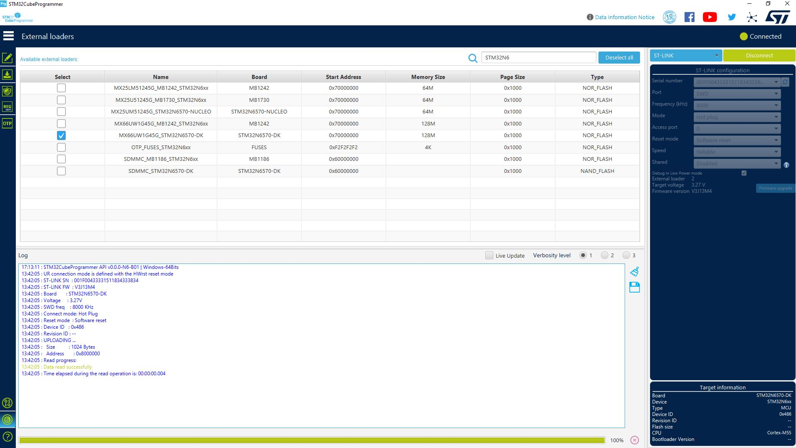
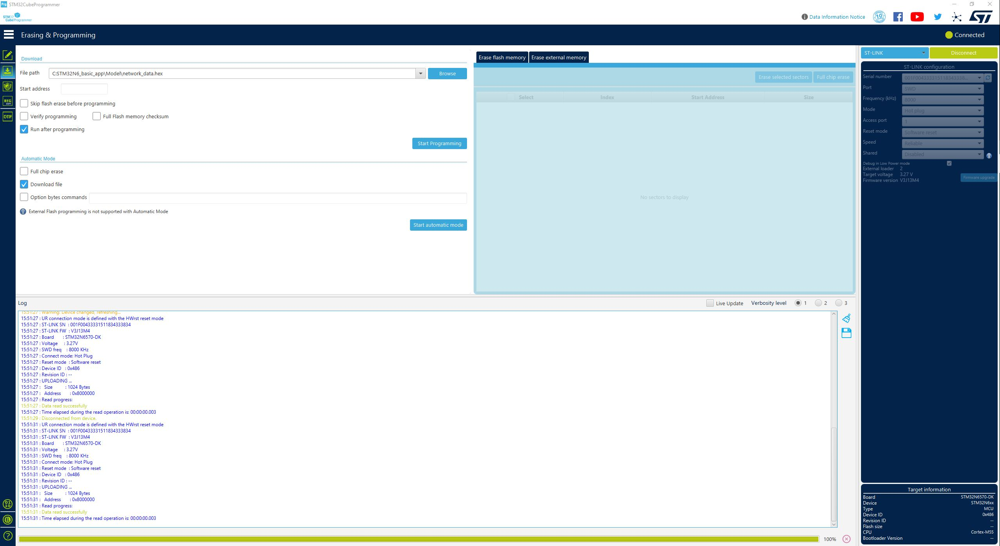

# How to Program hex files

0. Set your board in dev mode
1. Open STM32CubeProgrammer
2. Select your board through the "External loaders" tab.
3. ST-link configuration: mode set to "Hot plug"
4. Connect board
5. From "Erasing & programming" tab select the `Binary/ai_fsbl.hex` file
6. Wait for flashing
7. From "Erasing & programming" tab select the `Binary/<board_name>_network_data.hex` file
8. Wait for flashing
9. From "Erasing & programming" tab select the `Binary/<board_name>_GettingStarted_ImageClassification.hex` file
10. Wait for flashing
11. Set your board in boot from flash mode
12. Power cycle the board

__NOTE__: please refer to [this chapter of the top README](../README.md#boot-modes) to understand the boot modes
