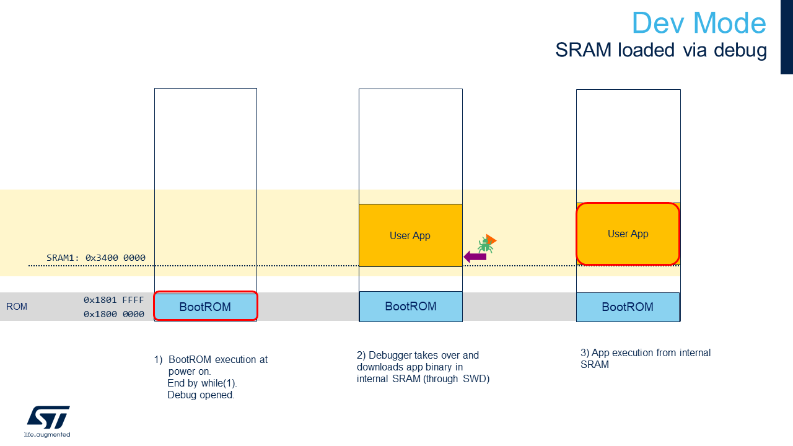

# Boot Overview

## Dev mode

## Boot from flash with First Stage Boot Loader

Note:
By default 1MB of SRAM1 is reserved for the User App (see [STM32N657xx.ld](../STM32CubeIDE/STM32N657xx.ld)) and 1MB of SRAM2 is reserved for the network activations (see [stm32n6-app2.mpool](../Model/my_mpools/stm32n6-app2.mpool)).
