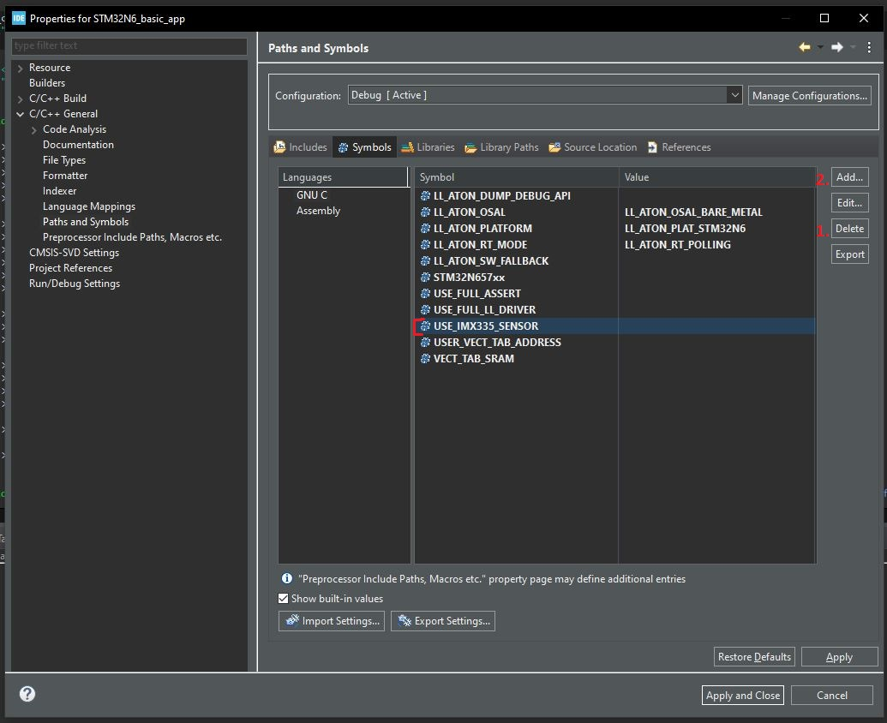
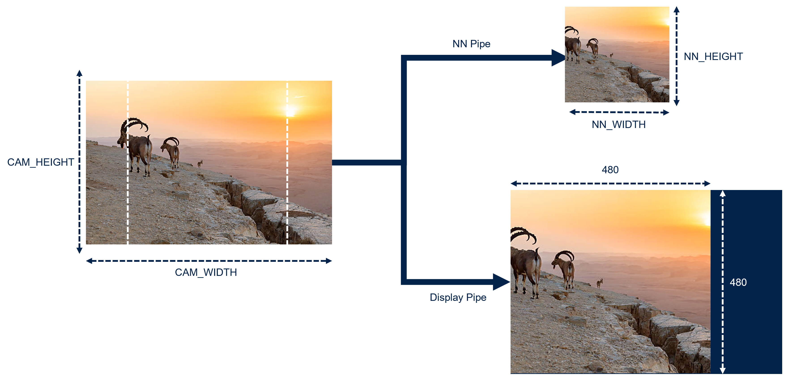
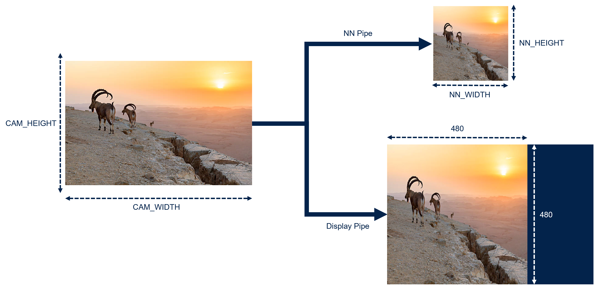
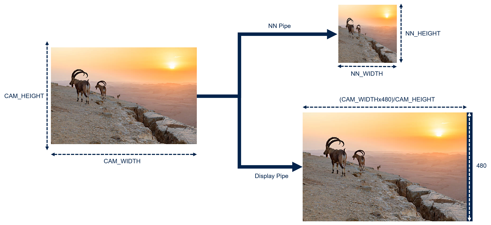

# Build Options

Some features are enabled using build options or using `app_config.h`:

- [Cameras module](#cameras-module)
- [Camera Orientation](#camera-orientation)
- [Aspect Ratio Mode](#aspect-ratio-mode)
- [Image preprocessing](#image-preprocessing)

This documentation explains those feature and how to modify them.

## Cameras module

The Application is compatible with 4 Cameras:

- MB1854B IMX335 (Default Camera provided with the MB1939 STM32N6570-DK board)
- ST VD66GY
- ST VD55G1

### Makefile

```bash
make -j8
```

### STM32CubeIDE

1. Right Click on the project -> Properties
2. Click on C/C++ General
3. Click on Path and Symbols
4. Click Symbols
5. Delete `USE_IMX335_SENSOR`
6. Add a Symbol following the pattern `USE_<CAMERA>_SENSOR`; Replace \<CAMERA\> by one of these IMX335; VD66GY; VD55G1
7. Click on Apply and Close



## Camera Orientation

Cameras allows to flip the image along 2 axis.

- CAMERA_FLIP_HFLIP: Selfie mode
- CAMERA_FLIP_VFLIP: Flip upside down.
- CAMERA_FLIP_HVFLIP: Flip Both axis
- CAMERA_FLIP_NONE: Default

1. Open [app_config.h](../Inc/app_config.h)

2. Change CAMERA_FLIP define:
```C
/*Defines: CMW_MIRRORFLIP_NONE; CMW_MIRRORFLIP_FLIP; CMW_MIRRORFLIP_MIRROR; CMW_MIRRORFLIP_FLIP_MIRROR;*/
#define CAMERA_FLIP CMW_MIRRORFLIP_FLIP
```

## Aspect Ratio Mode

### Image preprocessing

To fit the camera image to the NN input and to the display 3 options are provided.

- `ASPECT_RATIO_CROP`:
  - NN_Pipe: The frame is cropped to fit into a square with a side equal to the NN dimensions. The aspect ratio is kept but some pixels are lost on each side of the image.
  - Display_Pipe: The displayed frame is cropped identically to the nn pipe. We see what the nn sees but with an upscale format of 480x480 (Max height of the lcd display)



- `ASPECT_RATIO_FIT`:
  - NN_Pipe: The frame is resized to fit into a square with a side equal to the NN dimensions. The aspect ratio is modified.
  - Display_Pipe: The frame is resized as the NN. The frame is resized to fit into a square with a side equal to the height of the lcd display.



- `ASPECT_RATIO_FULLSCREEN`:
  - NN_Pipe: The frame is resized to fit into a square with a side equal to the NN dimensions. The aspect ratio is modified.
  - Display_Pipe: The frame is displayed full screen; We maximize the size of the display. The frame is not deformed. Aspect ratios of nn input and display are different.



1. Open [app_config.h](../Inc/app_config.h)
2. Change ASPECT_RATIO_MODE:

```C
#define ASPECT_RATIO_CROP (1)
#define ASPECT_RATIO_FIT (2)
#define ASPECT_RATIO_FULLSCREEN (3)
#define ASPECT_RATIO_MODE ASPECT_RATIO_FULLSCREEN
```
