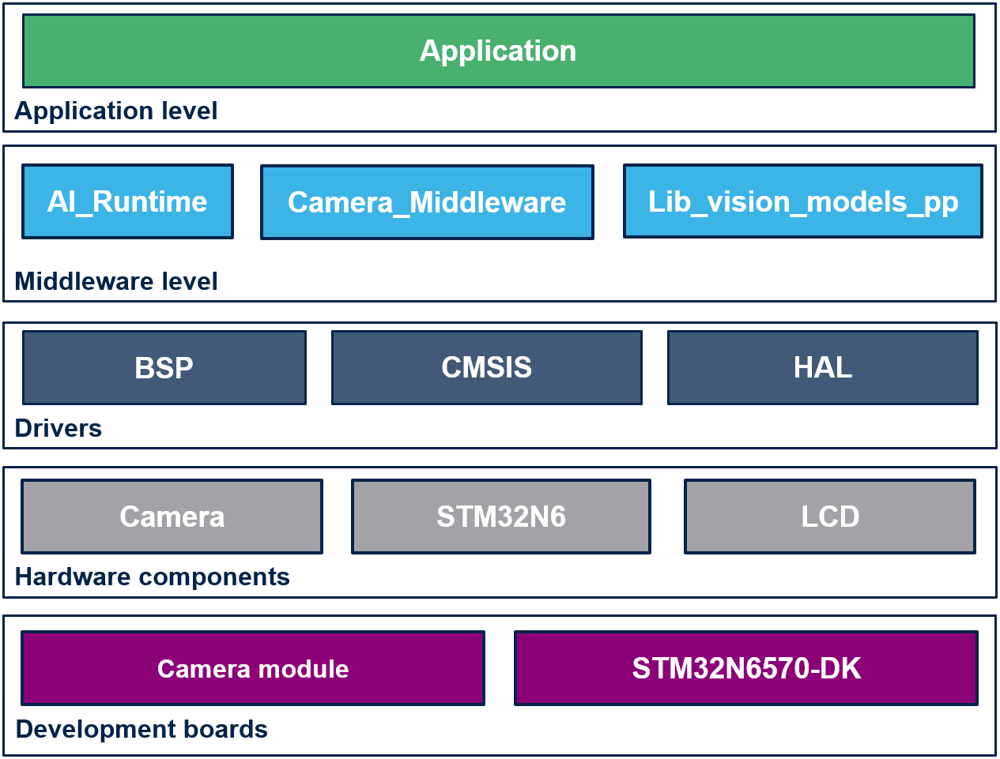
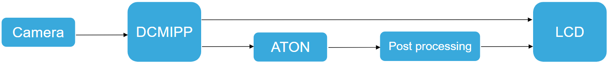

# __Image Classification ModelZoo__

This project provides an STM32 microcontroller embedded real-time environment to execute [STEdgeAI](https://www.st.com/en/development-tools/stedgeai-core.html) generated models targeting image classification application. The code developement is lead by its understandability rather than its performance, and is intended to be used as a starting point for further development.

## __Before You Start__

### __Software environment__

To deploy the application on your board, you need to download the STM32N6_GettingStarted software package from the [ST website](https://www.st.com/en/development-tools/stm32n6-ai.html). Download it and unzip it. Then copy/paste the `STM32N6_GettingStarted_V1.0.0/application_code` folder into the root folder of the ModelZoo (`model_zoo_services/`). This will fill all the application software of each use case and needs only to be done once.

### __Hardware environment__

To run these image classification application examples, you need the following hardware:

- [STM32N6570-DK](https://www.st.com/en/evaluation-tools/stm32n6570-dk.html) discovery board

And one of the following camera modules:
- Provided IMX335 camera module
- [STEVAL-55G1MBI](https://www.st.com/en/evaluation-tools/steval-55g1mbi.html)
- [STEVAL-66GYMAI1](https://www.st.com/en/evaluation-tools/steval-66gymai.html)

### __Tools installations__

This getting started requires [STM32CubeIDE](https://www.st.com/content/st_com/en/products/development-tools/software-development-tools/stm32-software-development-tools/stm32-ides/stm32cubeide.html) as well as [STEdgeAI](https://www.st.com/en/development-tools/stedgeai-core.html) (__v2.0.0__).

You can find the installation information in the parent [README](../../../image_classification/deployment/README.md) of the deployment part and the general [README](../../README.md) of the model zoo.

## __Deployment__

### __Generate C code from tflite file__

This repository does not provide the AI C-model generated by STEdgeAI.

The user needs to generate the AI C-model.

It is directly generated by the deployment script of the ModelZoo.

### __Build and deploy__

Run the `image_classification/src/stm32ai_main.py` script to automatically build and deploy the program on the target (if the hardware is connected).

You can launch the `STM32CubeIDE/.project` with STM32CubeIDE. With the IDE, you can modify, build, and deploy your project on the target. To update the weights, flash them by following the instructions in the [Program hex files](Doc/Program-Hex-Files-STM32CubeProgrammer.md) documentation.

## __Getting started deep dive__

This package enables the image classification application on an STM32 board.

## __Processing workflow__

The software executes an image classification on an image captured by the camera.

- The camera sends the image to the DCMIPP (Digital Camera Interface Pixel Pipeline) to crop, decimate, and downscale the image.

- The DCMIPP sends the image to two buffers with different resolutions and formats. DCMIPP pipe 1 sends the image into a PSRAM buffer, which will be displayed by the LTDC as a background image. DCMIPP pipe 2 sends the image into the NPURAM, which will be used as input by the model.

- The NPU processes inference on the model input.

- The output is post-processed by the lib_vision_models_pp, and the result is displayed on the LTDC as a foreground image.
