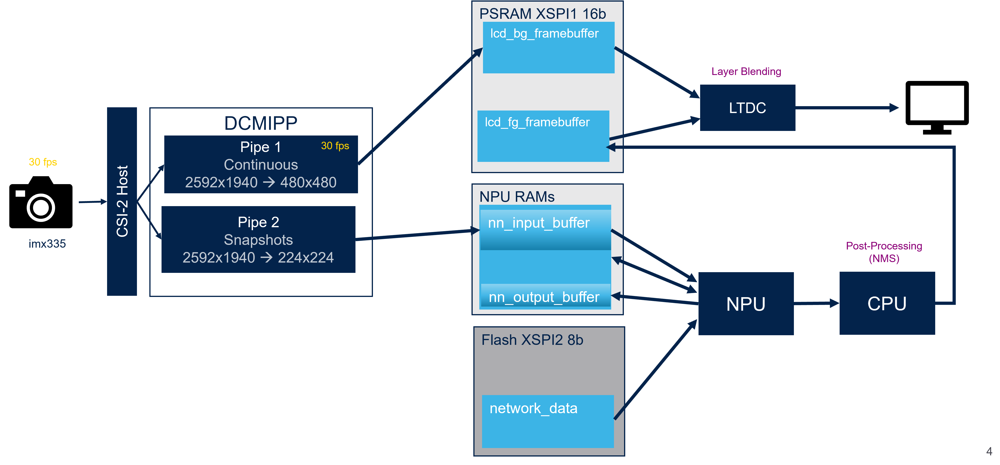

# Application overview

## DCMIPP and ISP

### DCMIPP overview

- Pipe 1 is enabled using `CMW_CAMERA_Start(0, DCMIPP_PIPE1, *ptr_dst, CAMERA_MODE_CONTINUOUS);` to continuously transmit images from imx335 to the LTDC frame buffer (`lcd_bg_framebuffer`).
- Pipe 2 is enabled using `CMW_CAMERA_Start(0, DCMIPP_PIPE2, *ptr_dst, CAMERA_MODE_SNAPSHOT);` to capture one frame (in the `nn_in` buffer) before launching the inference in the NPU.
- For each capture the ISP configuration is updated to enhance the image quality depending on the illumination conditions. It is initialized through `ISP_Init` and then executed with `ISP_BackgroundProcess`.

For more details of DCMIPP see Digital camera interface pixel pipeline (DCMIPP) in STM32N6 Reference manual.
