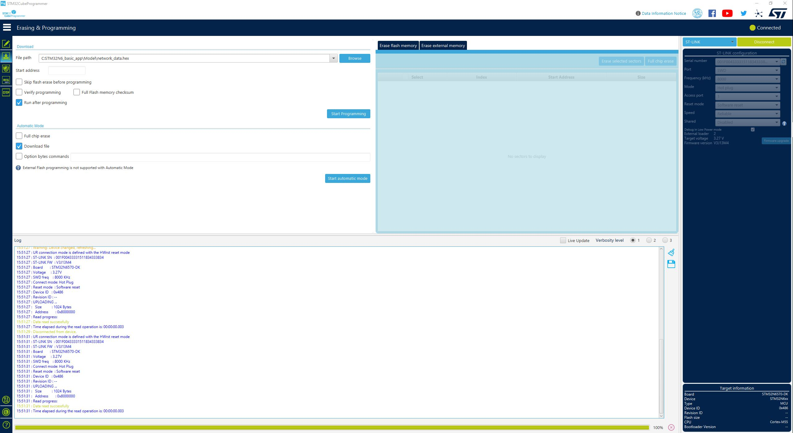

# How to Program hex files

0. Making sure board is in dev mode (boot switch in dev mode position)
1. Open STM32CubeProgrammer
2. Select the Disco board through the "External loaders" tab.
3. ST-link configuration: mode set to "Hot plug"
4. Connect board
5. From "Erasing & programming" tab select the `Binary/network_data.hex` file
6. Wait for flashing
7. From "Erasing & programming" tab select the `Binary/STM32N6_GettingStarted_ObjectDetection` file

