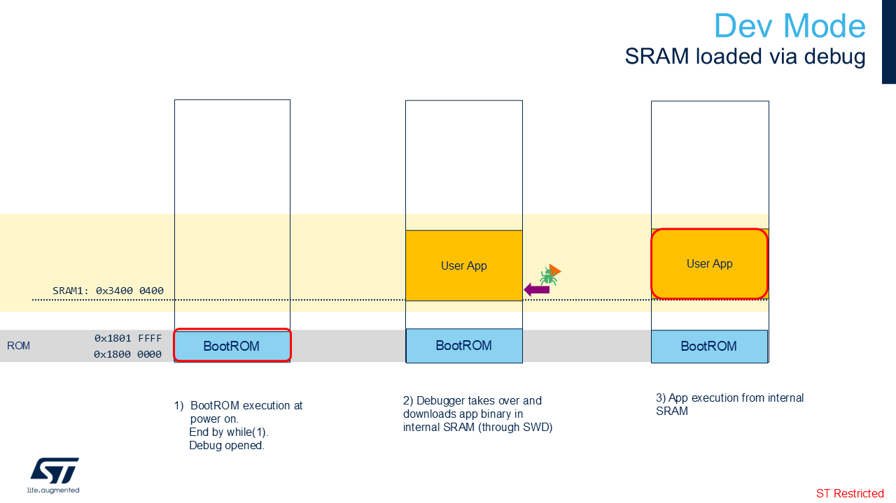

# Boot Overview

## Dev mode

## Boot from flash with First Stage Boot Loader

**Note:**
By default on:

- **STM32N6570-DK**: 1MB of SRAM1 is reserved for the User App (see [STM32N657xx.ld](../Application/STM32N6570-DK/STM32CubeIDE/STM32N657xx.ld)) and 1MB of SRAM2 is reserved for the network activations (see [stm32n6-app2_STM32N6570-DK.mpool](../Model/my_mpools/stm32n6-app2_STM32N6570-DK.mpool)).

- **NUCLEO-N657X0-Q**: 1MB of SRAM1 is reserved for the User App (see [STM32N657xx.ld](../Application/NUCLEO-N657X0-Q/STM32CubeIDE/STM32N657xx.ld)) and 1MB of SRAM2 is reserved for the network activations (see [stm32n6-app2_NUCLEO-N657X0-Q.mpool](../Model/my_mpools/stm32n6-app2_NUCLEO-N657X0-Q.mpool)).