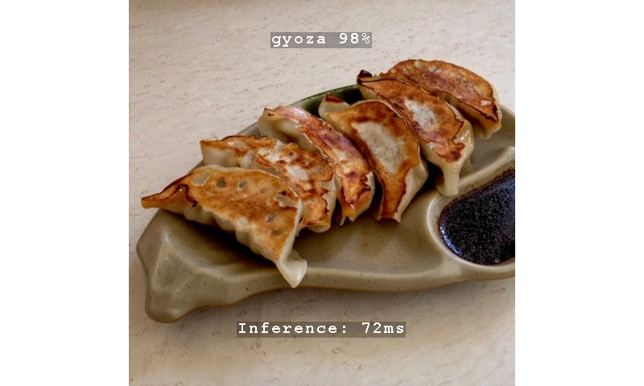

# __Image Classification Getting Started__

This project provides an STM32 microcontroller embedded real-time environment to execute [STEdgeAI](https://www.st.com/en/development-tools/stedgeai-core.html) generated models targeting image classification application. The code developement is lead by its understandability rather than its performance, and is intended to be used as a starting point for further development.


Detected class and confidence level are displayed.

This is a standalone project that can be used as-is to deploy the application on the hardware. However, it is also part of the [ST ModelZoo repo](https://github.com/STMicroelectronics/stm32ai-modelzoo-services) and is needed to deploy the image classification use case. The ModelZoo allows you to train, evaluate and deploy automatically any supported model. If you wish to use it as part of the ModelZoo, please refer to the [Quickstart using stm32ai-modelzoo-services](#quickstart-using-stm32ai-modelzoo-services) section on how to use it.

This top readme gives an overview of the app. Additional documentation is available in the [Doc](./Doc/) folder.

## __Directory contents__

This repository is structured as follows:

| Directory                                                              | Content                                                   |
|:-----------------------------------------------------------------------|:----------------------------------------------------------|
| Application/<board_name>/Inc                                           | Application include files                                 |
| Application/<board_name>/Src                                           | Application source files                                  |
| Application/Model/*                                                    | *Placeholder* for AI C-model; files generated by cubeAI   |
| STM32Cube_FW_N6/Drivers/CMSIS                                          | CMSIS Drivers                                             |
| STM32Cube_FW_N6/Drivers/BSP                                            | Board Support Package and Drivers                         |
| STM32Cube_FW_N6/Drivers/STM32XXxx_HAL_Driver                           | Hardware Abstraction Layer for STM32XXxx family products  |
| Middlewares/AI_Runtime                                                 | *Placeholder* for AI runtime library                      |
| Middlewares/Camera_Middleware                                          | Middleware to ease camera configuration                   |
| Middlewares/lib_vision_models_pp                                       | Computer vision models post processing                    |

## Table of Contents

README Content

- [Features demonstrated in this example](#features-demonstrated-in-this-example)
- [Hardware Support](#hardware-support)
- [Tools version](#tools-version)
- [Boot modes](#boot-modes)
- [Quickstart using stm32ai-modelzoo-services](#quickstart-using-stm32ai-modelzoo-services)
- [Quickstart using prebuilt binaries](#quickstart-using-prebuilt-binaries)
  - [How to program hex files using STM32CubeProgrammer UI](#how-to-program-hex-files-using-stm32cubeprogrammer-ui)
  - [How to program hex files on STM32N6570-DK using Command line](#how-to-program-hex-files-on-stm32n6570-dk-using-command-line)
  - [How to program hex files on NUCLEO-N657X0-Q using Command line](#how-to-program-hex-files-on-nucleo-n657x0-q-using-command-line)
- [Quickstart using source code](#quickstart-using-source-code)
  - [Application build and run - Dev mode](#application-build-and-run---dev-mode)
    - [STM32CubeIDE](#stm32cubeide)
    - [Makefile](#makefile)
  - [Application build and run - Boot from flash](#application-build-and-run---boot-from-flash)
    - [Build the application](#build-the-application)
      - [STM32CubeIDE](#stm32cubeide-1)
      - [Makefile](#makefile-1)
    - [Program the firmware in the external flash](#program-the-firmware-in-the-external-flash)
- [Known Issues and Limitations](#known-issues-and-limitations)

Doc Folder Content

- [Application overview](Doc/Application-Overview.md)
- [Boot Overview](Doc/Boot-Overview.md)
- [Camera build options](Doc/Build-Options.md#cameras-module)
- [Camera Orientation](Doc/Build-Options.md#camera-orientation)
- [Aspect Ratio mode](Doc/Build-Options.md#aspect-ratio-mode)
- [Deploy your tflite model on STM32N6570-DK](Doc/Deploy-your-tflite-Model-STM32N6570-DK.md)
- [Deploy your tflite model on NUCLEO-N657X0-Q](Doc/Deploy-your-tflite-Model-NUCLEO-N657X0-Q.md)
- [Program Hex Files STM32CubeProgrammer](Doc/Program-Hex-Files-STM32CubeProgrammer.md)

## Features demonstrated in this example

- Sequential application flow
- NPU accelerated quantized AI model inference
- Dual DCMIPP pipes
- DCMIPP crop, decimation, downscale
- DCMIPP ISP usage
- LTDC dual-layer implementation
- Dev mode
- Boot from External Flash

## Hardware Support

One of the following development platforms:

- [STM32N6570-DK](https://www.st.com/en/evaluation-tools/stm32n6570-dk.html) discovery board
  - The board should be connected to the onboard ST-LINK debug adapter CN6 with a __USB-C to USB-C cable to ensure sufficient power__
  - __Set the boot mode in dev mode__ (Both switches to the right side, (cf Boot modes of STM32N6 reference manual))
  - OTP fuses are set in this example for xSPI IOs in order to get the maximum speed (200MHz) on xSPI interfaces
- [NUCLEO-N657X0-Q](https://www.st.com/en/evaluation-tools/nucleo-n657x0-q.html) Nucleo board
  - The board should be connected to the onboard ST-LINK debug adapter CN9 with a __USB-C to USB-C cable to ensure sufficient power__
  - __Set the boot mode in dev mode__ (BOOT0 JP1 on position 1 and BOOT1 JP2 on position 2, (cf Boot modes of STM32N6 reference manual))
  - OTP fuses are set in this example for xSPI IOs in order to get the maximum speed (200MHz) on xSPI interfaces

And one of the following camera modules:

- Provided IMX335 camera module
- [STEVAL-55G1MBI](https://www.st.com/en/evaluation-tools/steval-55g1mbi.html)
- [STEVAL-66GYMAI1](https://www.st.com/en/evaluation-tools/steval-66gymai.html)

For the Nucleo board, you will need one of the following display:

- An USB host to which data will be transmitted via USB/UVC (using the USB OTG port)
- An [X-NUCLEO-GFX01M2](https://www.st.com/en/evaluation-tools/x-nucleo-gfx01m2.html) SPI display


STM32N6570-DK board with MB1854B IMX335.

## Tools version

- [STM32CubeIDE](https://www.st.com/content/st_com/en/products/development-tools/software-development-tools/stm32-software-development-tools/stm32-ides/stm32cubeide.html) (__STM32CubeIDE 1.17.0__)
- [STM32CubeProgrammer](https://www.st.com/en/development-tools/stm32cubeprog.html) (__v2.18.0__)
- [STEdgeAI](https://www.st.com/en/development-tools/stedgeai-core.html) (__v2.1.0__)

## Boot modes

The STM32N6 does not have any internal flash. To retain your firmware after a reboot, you must program it in the external flash. Alternatively, you can load your firmware directly from SRAM (dev mode). However, in dev mode if you turn off the board, your program will be lost.

__Boot modes:__

- Dev mode (STM32N6570-DK: both boot switches to the right, NUCLEO-N657X0-Q: BOOT0 JP1 in position 1, BOOT1 JP2 in position 2): used to load the firmware from debug session in RAM, or program firmware in external flash
- Boot from flash (STM32N6570-DK: both boot switches to the left, NUCLEO-N657X0-Q: BOOT0 JP1 in position 1, BOOT1 JP2 in position 1): used to boot the firmware in external flash

## Quickstart using stm32ai-modelzoo-services

This application is a C-based project needed by the deployment service in the ModelZoo [ModelZoo](https://github.com/STMicroelectronics/stm32ai-modelzoo-services/tree/main).
The ModelZoo enables you to train, evaluate, and automatically deploy any supported model.

To deploy your model using the ModelZoo, refer to the [Deployment README for STM32N6](https://github.com/STMicroelectronics/stm32ai-modelzoo-services/blob/main/image_classification/deployment/README_STM32N6.md) for detailed instructions on deploying to either the STM32N6570-DK or the NUCLEO-N657X0-Q.

__Note__: This C-Based application is already in the ModelZoo repo in the [STM32N6 image classification application code folder](https://github.com/STMicroelectronics/stm32ai-modelzoo-services/tree/main/application_code/image_classification/STM32N6).

## Quickstart using prebuilt binaries

Three binaries must be programmed in the board external flash using the following procedure:

  1. Set your board in dev mode
  2. Program `Binary/ai_fsbl.hex` (First Stage Boot Loader)
  3. Program `Binary/STM32N6570-DK_network_data.hex` or `Binary/NUCLEO-N657X0-Q_network_data.hex` (params of the networks; To be changed only when the network is changed)
  4. Program `Binary/STM32N6570-DK_GettingStarted_ImageClassification.hex` or `Binary/NUCLEO-N657X0-Q_GettingStarted_ImageClassification.hex` depending on the board you use (firmware application)
  5. Set your board in boot from flash mode
  6. Power cycle the board

__Note__: The `Binary/STM32N6570-DK_GettingStarted_ImageClassification.hex` firmware is built for MB1939 STM32N6570-DK REV C02 with any of the listed required camera module.
__Note__: The `Binary/NUCLEO-N657X0-Q_GettingStarted_ImageClassification.hex` firmware is built for MB1940 NUCLEO-N657X0-Q REV C01 with USB/UVC host display and any of the listed required camera module.

### How to program hex files using STM32CubeProgrammer UI

See [How to program hex files STM32CubeProgrammer](Doc/Program-Hex-Files-STM32CubeProgrammer.md)

### How to program hex files on STM32N6570-DK using Command line

Make sure to have the STM32CubeProgrammer bin folder added in your path.

```bash
export DKEL="<STM32CubeProgrammer_N6 Install Folder>/bin/ExternalLoader/MX66UW1G45G_STM32N6570-DK.stldr"

# First Stage Boot loader
STM32_Programmer_CLI -c port=SWD mode=HOTPLUG -el $DKEL -hardRst -w Binary/ai_fsbl.hex

# Network parameters and biases
STM32_Programmer_CLI -c port=SWD mode=HOTPLUG -el $DKEL -hardRst -w Binary/STM32N6570-DK_network_data.hex

# Application Firmware
STM32_Programmer_CLI -c port=SWD mode=HOTPLUG -el $DKEL -hardRst -w Binary/STM32N6570-DK_GettingStarted_ImageClassification.hex
```

### How to program hex files on NUCLEO-N657X0-Q using Command line

Make sure to have the STM32CubeProgrammer bin folder added in your path.

```bash
export NUEL="<STM32CubeProgrammer_N6 Install Folder>/bin/ExternalLoader/MX25UM51245G_STM32N6570-NUCLEO.stldr"

# First Stage Boot loader
STM32_Programmer_CLI -c port=SWD mode=HOTPLUG -el $NUEL -hardRst -w Binary/ai_fsbl.hex

# Network parameters and biases
STM32_Programmer_CLI -c port=SWD mode=HOTPLUG -el $NUEL -hardRst -w Binary/NUCLEO-N657X0-Q_network_data.hex

# Application Firmware
STM32_Programmer_CLI -c port=SWD mode=HOTPLUG -el $NUEL -hardRst -w Binary/NUCLEO-N657X0-Q_GettingStarted_ImageClassification.hex
```

## Quickstart using source code

Before building and running the application you have to program `<board_name>_network_data.hex` (model weights and biases).
This step only has to be done once unless you change AI model.
See [Quickstart using prebuilt binaries](#quickstart-using-prebuilt-binaries) for details.

More information about boot modes is available at [Boot Overview](Doc/Boot-Overview.md)

### Application build and run - Dev mode

Set your board in dev mode.

#### STM32CubeIDE

Double click on `Application/<board_name>/STM32CubeIDE/.project` to open project in STM32CubeIDE. Build and run.

#### Makefile

Go to `Application/<board_name>/`, and run the following commands (be sure to add them in your PATH before).

1. Build project using the provided `Makefile`:

```bash
make -j8
```

2. Open a gdb server connected to the STM32 target:

```bash
ST-LINK_gdbserver -p 61234 -l 1 -d -s -cp <path-to-stm32cubeprogramer-bin-dir> -m 1 -g
```

3. In a separate terminal launch a GDB session to load the firmware into the device memory:

```bash
$ arm-none-eabi-gdb build/Application/<board_name>/Project.elf
(gdb) target remote :61234
(gdb) monitor reset
(gdb) load
(gdb) continue
```

### Application build and run - Boot from flash

Set your board in dev mode.

#### Build the application

##### STM32CubeIDE

Double click on `Application/<board_name>/STM32CubeIDE/.project` to open project in STM32CubeIDE. Build and run.

##### Makefile

Before running commands below be sure to have commands in your PATH.

Build project using the provided `Makefile`:

```bash
make -j8
```

#### Program the firmware in the external flash

Once your app is built with Makefile, STM32CubeIDE, you can add a signature to the bin file:

```bash
STM32_SigningTool_CLI -bin build/Application/<board_name>/Project.bin -nk -t ssbl -hv 2.3 -o build/Application/<board_name>/Project_sign.bin
```

You can program the signed bin file at the address `0x70100000`.

On the STM32N6570-DK:

```bash
export DKEL="<STM32CubeProgrammer_N6 Install Folder>/bin/ExternalLoader/MX66UW1G45G_STM32N6570-DK.stldr"

# Adapt build path to your IDE
STM32_Programmer_CLI -c port=SWD mode=HOTPLUG -el $DKEL -hardRst -w build/Application/<board_name>/Project_sign.bin 0x70100000
```

On the NUCLEO-N657X0-Q:

```bash
export NUEL="<STM32CubeProgrammer_N6 Install Folder>/bin/ExternalLoader/MX25UM51245G_STM32N6570-NUCLEO.stldr"

# Adapt build path to your IDE
STM32_Programmer_CLI -c port=SWD mode=HOTPLUG -el $NUEL -hardRst -w build/Application/<board_name>/Project_sign.bin 0x70100000
```

__Note__: Only the app binary needs to be programmed if the fsbl and network_data.hex was previously programmed.

Set your board in boot from flash mode.

Do a power cycle to boot from the external flash.

## Known Issues and Limitations

- Only RGB888 format for nn input has been tested.
- Only UINT8 format for nn input is supported.
